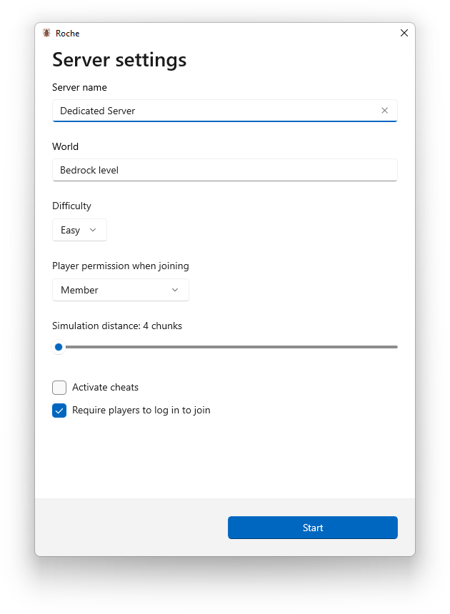

🪳 Roche
=======

Start your own Minecraft (Bedrock) server. This app helps you download, configure, and run the server software to host a LAN game that anyone on your network can connect to.

Screenshot
----------

